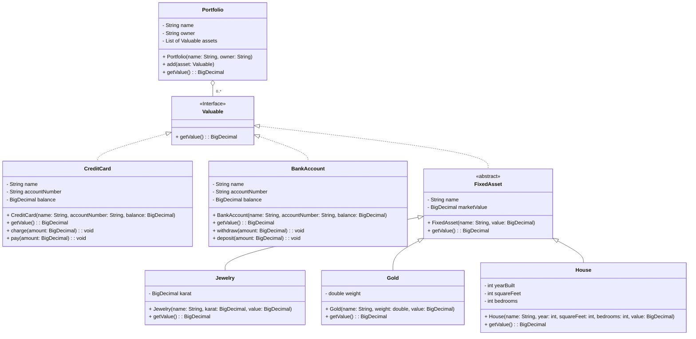

```mermaid
classDiagram
    class Portfolio {
        - String name
        - String owner
        - List of Valuable assets
        + Portfolio(name: String, owner: String)
        + add(asset: Valuable)
        + getValue(): BigDecimal
    }

    class Valuable {
        <<Interface>>
        + getValue(): BigDecimal
    }

    class CreditCard {
        - String name
        - String accountNumber
        - BigDecimal balance
        + CreditCard(name: String, accountNumber: String, balance: BigDecimal)
        + getValue(): BigDecimal
        + charge(amount: BigDecimal): void
        + pay(amount: BigDecimal): void
    }

    class BankAccount {
        - String name
        - String accountNumber
        - BigDecimal balance
        + BankAccount(name: String, accountNumber: String, balance: BigDecimal)
        + getValue(): BigDecimal
        + withdraw(amount: BigDecimal): void
        + deposit(amount: BigDecimal): void
    }

    class FixedAsset {
        <<abstract>>
        - String name
        - BigDecimal marketValue
        + FixedAsset(name: String, value: BigDecimal)
        + getValue(): BigDecimal
    }

    class Jewelry {
        - BigDecimal karat
        + Jewelry(name: String, karat: BigDecimal, value: BigDecimal)
        + getValue(): BigDecimal
    }

    class Gold {
        - double weight
        + Gold(name: String, weight: double, value: BigDecimal)
        + getValue(): BigDecimal
    }

    class House {
        - int yearBuilt
        - int squareFeet
        - int bedrooms
        + House(name: String, year: int, squareFeet: int, bedrooms: int, value: BigDecimal)
        + getValue(): BigDecimal
    }

    Portfolio o-- "0..*" Valuable
    Valuable <|.. BankAccount
    Valuable <|.. FixedAsset
    Valuable <|.. CreditCard

    FixedAsset <|-- Jewelry
    FixedAsset <|-- Gold
    FixedAsset <|-- House
```